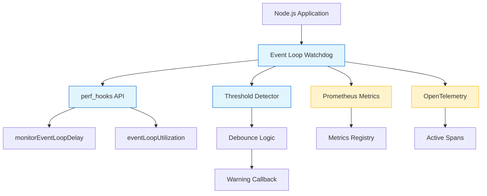

# @mieweb/loopwatch

> Node.js Event Loop Watchdog with Prometheus and OpenTelemetry Support

A lightweight, production-ready npm package that monitors Node.js event loop health and detects sustained backpressure. Integrates seamlessly with Prometheus, OpenTelemetry, and PMM-style monitoring systems.

## 🎯 Features

- **Low-overhead monitoring** using Node.js `perf_hooks` API
- **Intelligent alerting** with configurable thresholds and debounce logic
- **Prometheus metrics** export (p50/p95/p99 delay, max delay, ELU)
- **Optional OpenTelemetry** span annotations (zero hard dependencies)
- **Production-safe** with <1% CPU overhead
- **Zero vendor lock-in** - works standalone or with observability tools
- **Multi-process friendly** for systemd and containerized deployments

## 📦 Installation

```bash
npm install @mieweb/loopwatch
```

### Optional Peer Dependencies

```bash
# For Prometheus metrics
npm install prom-client

# For OpenTelemetry integration
npm install @opentelemetry/api
```

## 🚀 Quick Start

### Basic Usage

```typescript
import { startEventLoopWatchdog } from '@mieweb/loopwatch';

// Start with defaults
const watchdog = startEventLoopWatchdog({
  onWarning(info) {
    console.warn('Event loop backpressure detected:', info.message);
  }
});

// Later: stop monitoring
watchdog.stop();
```

### With Prometheus

```typescript
import { startEventLoopWatchdog } from '@mieweb/loopwatch';
import { register } from 'prom-client';

const watchdog = startEventLoopWatchdog({
  prometheus: {
    register, // Use default registry
  },
  onWarning(info) {
    logger.warn({ 
      p95: info.stats.p95,
      elu: info.stats.elu,
      consecutive: info.consecutiveCount 
    }, info.message);
  }
});

// Metrics are now available at your /metrics endpoint
```

### With OpenTelemetry

```typescript
import { startEventLoopWatchdog } from '@mieweb/loopwatch';

const watchdog = startEventLoopWatchdog({
  otel: {
    annotateSpan: true,  // Add attributes to active span
    emitSpan: true,      // Emit diagnostic span on backpressure
  },
  onWarning(info) {
    // Your logging here
  }
});
```

## 📚 API Documentation

### `startEventLoopWatchdog(config?)`

Creates and starts an event loop watchdog.

#### Configuration Options

```typescript
interface WatchdogConfig {
  // Sampling interval in milliseconds (default: 1000)
  sampleMs?: number;

  // Warning threshold for p95 lag in ms (default: 75)
  lagP95WarnMs?: number;

  // Warning threshold for event loop utilization 0-1 (default: 0.9)
  eluWarn?: number;

  // Consecutive threshold breaches required (default: 5)
  consecutive?: number;

  // Cooldown period between warnings in ms (default: 60000)
  cooldownMs?: number;

  // Prometheus configuration
  prometheus?: {
    register?: Registry;  // Optional custom registry
    prefix?: string;      // Metric name prefix (default: 'node')
  };

  // OpenTelemetry configuration
  otel?: {
    annotateSpan?: boolean;  // Annotate active span (default: true)
    emitSpan?: boolean;      // Emit diagnostic span (default: false)
  };

  // Warning callback
  onWarning?: (info: WarningInfo) => void;
}
```

#### Warning Info

```typescript
interface WarningInfo {
  stats: EventLoopStats;
  consecutiveCount: number;
  message: string;
  lagThresholdBreached: boolean;
  eluThresholdBreached: boolean;
}

interface EventLoopStats {
  p50: number;        // p50 delay in ms
  p95: number;        // p95 delay in ms
  p99: number;        // p99 delay in ms
  max: number;        // max delay in ms
  elu: number;        // event loop utilization (0-1)
  timestamp: Date;    // sample timestamp
}
```

#### Watchdog Methods

```typescript
interface Watchdog {
  stop(): void;                         // Stop monitoring
  getStats(): EventLoopStats | null;    // Get current stats
}
```

## 📊 Prometheus Metrics

When Prometheus integration is enabled, the following metrics are exported:

- `node_event_loop_delay_p50_ms` - Event loop delay p50 percentile
- `node_event_loop_delay_p95_ms` - Event loop delay p95 percentile
- `node_event_loop_delay_p99_ms` - Event loop delay p99 percentile
- `node_event_loop_delay_max_ms` - Event loop delay maximum
- `node_event_loop_utilization` - Event loop utilization (0-1)

### Example Grafana Query

```promql
# Show p95 event loop delay
node_event_loop_delay_p95_ms

# Alert on sustained high delay
node_event_loop_delay_p95_ms > 100

# Show utilization as percentage
node_event_loop_utilization * 100
```

## 🔍 OpenTelemetry Integration

When OTel is available, the watchdog can:

1. **Annotate Active Spans** - Add event loop metrics as span attributes
2. **Emit Diagnostic Spans** - Create spans when backpressure is detected

### Span Attributes

```
eventloop.delay.p50: 10.5
eventloop.delay.p95: 45.2
eventloop.delay.p99: 98.3
eventloop.delay.max: 150.1
eventloop.utilization: 0.85
eventloop.backpressure: true
eventloop.consecutive_breaches: 5
```

## 🏗️ Deployment Examples

### Express Application

```typescript
import express from 'express';
import { startEventLoopWatchdog } from '@mieweb/loopwatch';
import { register } from 'prom-client';

const app = express();

// Start watchdog early in application lifecycle
const watchdog = startEventLoopWatchdog({
  prometheus: { register },
  onWarning(info) {
    console.error('[WATCHDOG]', info.message, {
      p95: info.stats.p95,
      elu: info.stats.elu,
    });
  }
});

// Expose Prometheus metrics
app.get('/metrics', async (req, res) => {
  res.set('Content-Type', register.contentType);
  res.end(await register.metrics());
});

app.listen(3000);

// Cleanup on shutdown
process.on('SIGTERM', () => {
  watchdog.stop();
  process.exit(0);
});
```

### Systemd Service

```ini
[Unit]
Description=My Node.js App with Loopwatch
After=network.target

[Service]
Type=simple
User=nodejs
WorkingDirectory=/opt/myapp
ExecStart=/usr/bin/node dist/server.js
Restart=always
RestartSec=10

# Environment
Environment="NODE_ENV=production"

[Install]
WantedBy=multi-user.target
```

### Docker Container

```dockerfile
FROM node:20-alpine

WORKDIR /app
COPY package*.json ./
RUN npm ci --only=production

COPY . .

# Expose app and metrics
EXPOSE 3000 9090

CMD ["node", "dist/server.js"]
```

## ⚠️ Recommended Alert Thresholds

Based on production experience:

### Conservative (Low False Positive Rate)

```yaml
- alert: NodeEventLoopSaturated
  expr: node_event_loop_delay_p95_ms > 100
  for: 5m
  annotations:
    summary: "Node.js event loop is saturated"
    
- alert: NodeEventLoopHighUtilization
  expr: node_event_loop_utilization > 0.95
  for: 5m
  annotations:
    summary: "Node.js event loop utilization is very high"
```

### Aggressive (Early Warning)

```yaml
- alert: NodeEventLoopDegraded
  expr: node_event_loop_delay_p95_ms > 50
  for: 2m
  
- alert: NodeEventLoopBusy
  expr: node_event_loop_utilization > 0.85
  for: 2m
```

## 🐛 Troubleshooting

### When the Watchdog Fires

The watchdog triggers when the event loop is consistently struggling. Investigate:

1. **CPU-bound operations** - Heavy computation blocking the event loop
2. **Synchronous I/O** - `fs.readFileSync()`, blocking network calls
3. **Memory pressure** - Garbage collection pauses
4. **High request volume** - Too many concurrent requests
5. **Inefficient algorithms** - O(n²) operations on large datasets

### Common Causes

```typescript
// ❌ Bad: Blocking operation
const data = fs.readFileSync('large-file.json');

// ✅ Good: Async operation
const data = await fs.promises.readFile('large-file.json');

// ❌ Bad: Heavy sync processing
const results = items.map(item => heavyProcessing(item));

// ✅ Good: Batch with setImmediate
async function processBatches(items) {
  for (let i = 0; i < items.length; i += 100) {
    const batch = items.slice(i, i + 100);
    await Promise.all(batch.map(heavyProcessing));
    await new Promise(resolve => setImmediate(resolve));
  }
}
```

### Debug Mode

```typescript
const watchdog = startEventLoopWatchdog({
  sampleMs: 500,      // Sample more frequently
  consecutive: 3,     // Trigger sooner
  cooldownMs: 10000,  // Log more often
  onWarning(info) {
    console.log('Event loop stats:', {
      p50: info.stats.p50,
      p95: info.stats.p95,
      p99: info.stats.p99,
      max: info.stats.max,
      elu: (info.stats.elu * 100).toFixed(1) + '%',
    });
  }
});
```

## 🎨 Architecture



## 🔒 Security Considerations

- **No secrets exposed** - Metrics contain only performance data
- **No PII** - All data is aggregate statistics
- **Low resource usage** - <1% CPU overhead prevents DoS risk
- **Optional features** - Prometheus/OTel are opt-in

## 📝 License

Apache-2.0

## 🤝 Contributing

Contributions welcome! Please read our contributing guidelines and code of conduct.

## 📖 More Information

- [Node.js Performance Hooks Documentation](https://nodejs.org/api/perf_hooks.html)
- [Prometheus Best Practices](https://prometheus.io/docs/practices/)
- [OpenTelemetry JavaScript](https://opentelemetry.io/docs/instrumentation/js/)

## 💡 Motivation

Node.js applications can experience degraded performance without traditional monitoring showing issues. The event loop is the heart of Node.js, but there's no built-in watchdog or alerting mechanism. This package fills that gap with a production-ready, standards-based solution.

### What This Package Does

- ✅ Detects event loop backpressure early
- ✅ Provides actionable metrics
- ✅ Integrates with existing observability tools
- ✅ Safe to run in production 24/7

### What This Package Doesn't Do

- ❌ Automatically terminate processes
- ❌ Implement load shedding or throttling
- ❌ Auto-instrument your application
- ❌ Replace APM solutions
